## 티스토리 목차 네비게이터 만들기(ver_1) by LabMate
* 매우 쉽고 간단합니다
* 각 티스토리의 테마에 맞게 수정할 수 있도록 css에 주석을 달아두었습니다
* 네비게이터를 만드는 기준
  * 본문에서 제목1(h1), 제목2(h2), 제목3(h3), 제목1(h1)
  * blockquote(그 중에서 data-ke-style="style2"인 것) 입니다
  * 네비게이터 기준에 따라 글을 작성하면 좋습니다
* 각 목차별 레벨은 설정하지 않았습니다. 모두 동일 레벨입니다
* 궁금한 점은 티스토리에 댓글 달아주세요
* /네비게이터 글 링크/


<br>


### 적용 결과 (우측 회색 네비게이터)
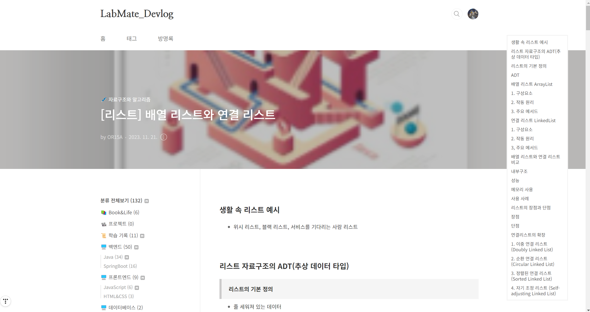
* 글자를 누르면 페이지 내에서 이동이 가능합니다
* 스크롤을 내려도 따라다닙니다


<br>
<br>

#### 설정 전 저의 티스토리 스킨 정보 입니다
* Book club 스킨을 적용하고 있습니다
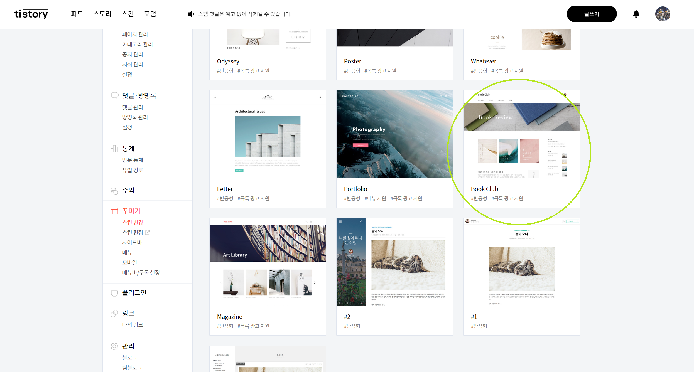
* 글 페이지에서 백그라운드 컬러나 코드 스타일을 약간 수정한 상태입니다
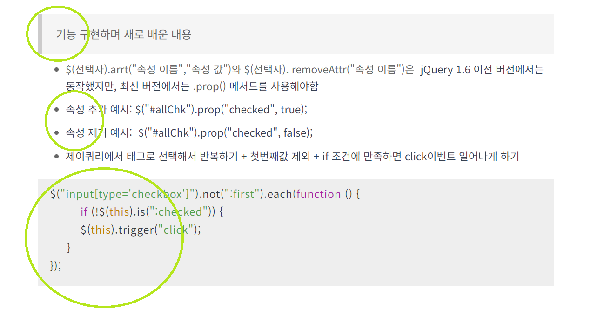


<br>


### 적용 방법

#### 1. 티스토리 글 관리 > 스킨편집 > html편집
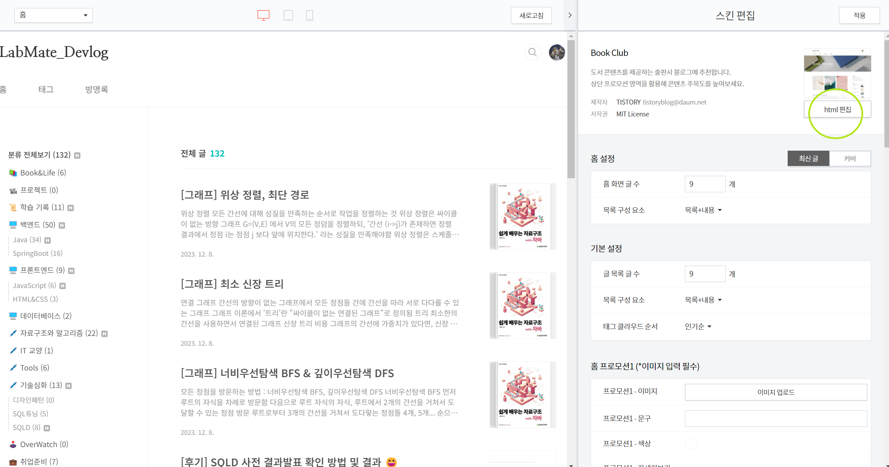

<br>

#### 2. /head 태그를 찾고 그 위에 아래의 코드를 붙여넣습니다
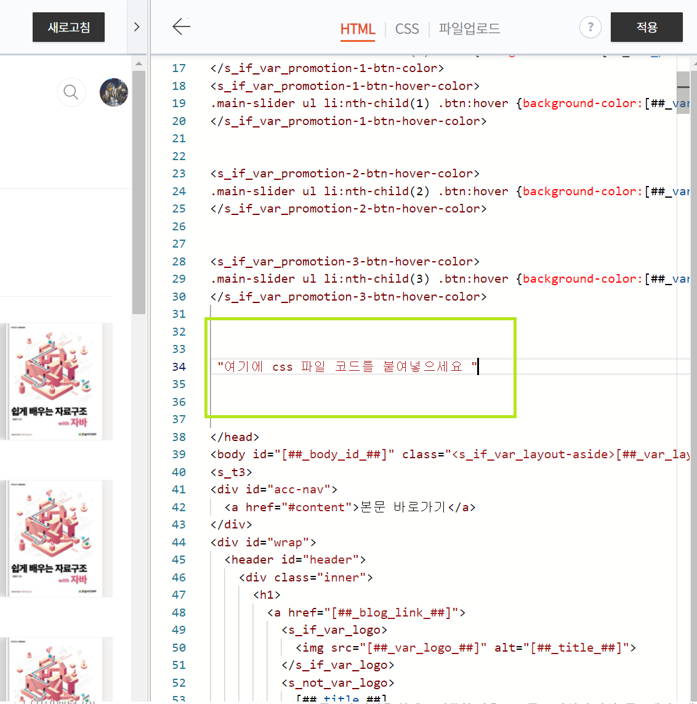
```html
<style>
    
    /*본문과 네비게이션을 감싸는 div*/
    .parent-flex-navigator {
        display: flex;
    }

    
    /*목차 네비게이터 css*/
    #tag-navigation {
        flex-basis: 20%;
        background-color: white;
        border: solid 3px #F5F5F5;
        position: fixed;
        top: 50px; /*상단 고정값*/
        right: 0; /*우측 고정 값*/
        margin-right: 50px;
        margin-top: 50px;
        width: 150px;
        padding: 10px;
        font-size: 0.8rem; /*글자 크기*/
        z-index: 9999; /* 다른 요소보다 위에 올림 */
    }
    
    /*li 태그의 동그라미 없애기css*/
    #tag-navigation a li {
        list-style-type: none;
    }
    
</style>
```

<br>

#### 3. html소스에서 ctrl+f를 눌러서  div class="content-wrap" 를 찾습니다
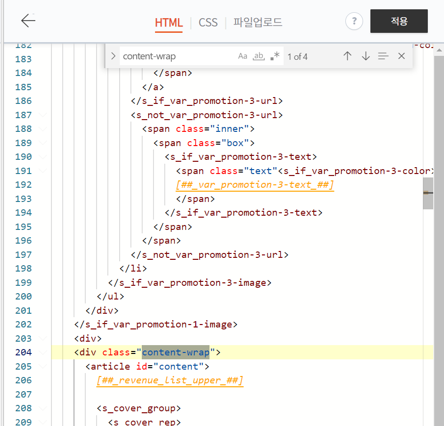
* 그 태그의 바로 위 div태그에 class="parent-flex-navigator"를 추가해줍니다
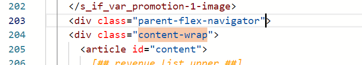


<br>

#### 4. 스크롤을 쭉 내려서 아래에서 /body 태그를 찾고 태그를 붙여넣습니다
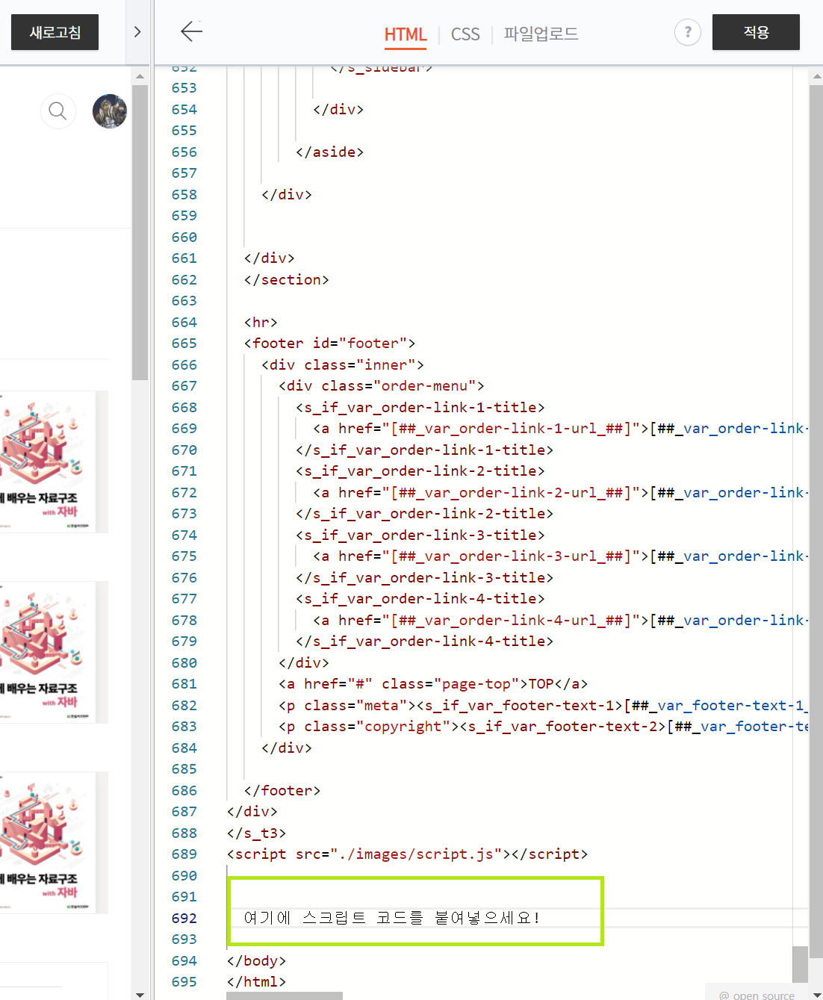
```html
<script>
    /*
    * 해당 페이지가 '글' 형식일 때만 네비게이터 표시하기
    * */
        
    // 현재 페이지의 URL
    let currentUrl = window.location.href;
    
    // 티스토리 글 페이지 URL 패턴: 숫자만 있는 패턴
    let postPagePattern = /^https:\/\/labmate-dev\.tistory\.com\/\d+$/;
    
    // 글일 경우에에
    if (postPagePattern.test(currentUrl)) {
        //네비게이터 div만들기
        makeNaviDiv();
    
        //해당 div 안에 링크태그 만들기
        fillTagNavigationDiv();
    
        //네비게이터 내용물이 없을 경우 숨기기
        hideNaviDiv();
    
    } else {
    
        //스킨 편집할 일 있을 때 아래 주석 풀고 css 등을 고치세요!
    /*    //네비게이터 div만들기
        makeNaviDiv();
        //해당 div 안에 링크태그 만들기
        fillTagNavigationDiv();*/
    }
    
    
    
    /*
    * 네이게이터 div 만들기
    * */
    function makeNaviDiv() {
    
        // <div class="content-wrap"> 태그 가져오기
        let contentWrap = document.querySelector('.content-wrap');
    
    
        if (contentWrap) {
            // <div id="tag-navigation" class="tag-navigation"> 태그 생성
            let tagNavigationDiv = document.createElement('div');
            tagNavigationDiv.id = 'tag-navigation';
            tagNavigationDiv.className = 'tag-navigation';
    
            // <div class="content-wrap"> 태그의 마지막 자식으로 추가
            contentWrap.appendChild(tagNavigationDiv);
        }
    }
    
    
    
    /*
    * div 태그 채우기
    * 조건 : 본문에서 제목1(h1), 제목2(h2), 제목3(h3), 제목1(h1), blockquote(그 중에서 data-ke-style="style2"인 것)
    * */
    function fillTagNavigationDiv() {
        // contents_style 클래스를 가진 div 요소 선택
        let contentsDiv = document.querySelector('.contents_style');
    
    
        // h1, h2, h3, blockquote 태그들을 선택
        let headingsAndBlockquotes = contentsDiv.querySelectorAll('h1, h2, h3, blockquote');
    
        // 찾은 태그들 위에서부터 반복하면서 링크 만들기. <a><li></li></a> 형태로 만들 예정
        headingsAndBlockquotes.forEach(function (element, index) {
    
            //링크들이 들어갈 div
            let naviDivElement = document.getElementById('tag-navigation');
    
            // 각 요소의 텍스트 내용 가져오기
            let textContent = element.textContent.trim();
    
            // 요소가 비어있으면 링크 안만듦
            if (textContent == "") {
                return;
            }
    
            // blockquote 태그인 경우 data-ke-style 값 확인
            if (element.tagName == 'BLOCKQUOTE') {
                let dataKeyStyle = element.getAttribute('data-ke-style');
                if (dataKeyStyle !== 'style2') {
                    return; // data-ke-style이 style2가 아니면 건너뜀
                }
            }
    
            // 목차 항목을 생성하고 추가하기
            let listItem = document.createElement('li');  //<li></li>
            let link = document.createElement('a');   //<a></a>
            link.href = '#navipass-' + index;
            listItem.textContent = textContent;
    
            // 링크 아래 여백 주기 (마지막 요소 빼고)
            listItem.style.marginBottom = '10px';
            if (index == headingsAndBlockquotes.length - 1) {
                listItem.style.marginBottom = '0px';
            }
    
            link.appendChild(listItem);       //결과:      <a><li></li></a>
            naviDivElement.appendChild(link); //결과: <div><a><li></li></a></div>
    
            // 각 요소에 고유한 ID 부여
            element.id = 'navipass-' + index;
        });
    }
    
    
    // 요소 없는 div 숨기기
    function hideNaviDiv() {
        // #tag-navigation 내부의 <a> 태그 개수를 확인
        let linkCount = $("#tag-navigation a").length;
    
        // 만약 <a> 태그가 하나도 없으면 #tag-navigation를 숨깁니다.
        if (linkCount === 0) {
            $("#tag-navigation").hide();
        }
    }

    
</script>
```

<br> 

#### 5. [적용] 버튼을 누르고 확인합니다. 
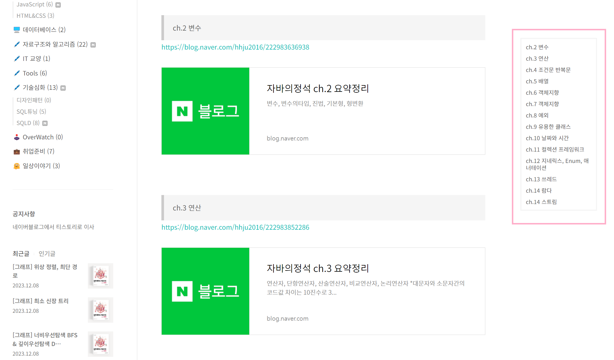


<br> 

#### 6. 디자인을 수정하고 싶을 때
* 스트립트에서 아래 부분 주석을 풀고 왼쪽 화면의 [새로고침]을 누르고
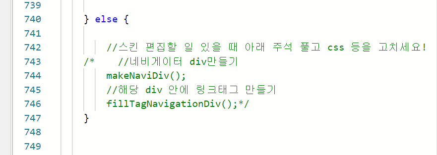
* 상단의 css부분을 고칩니다
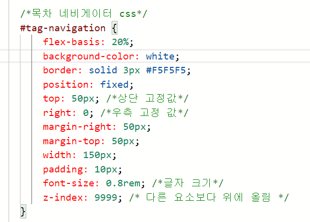
* 상자 색깔 background-color
* 테두리 border
* 그 외에도 글자 색깔, 테두리 둥글리기, 위치 변경을 할 수 있습니다


